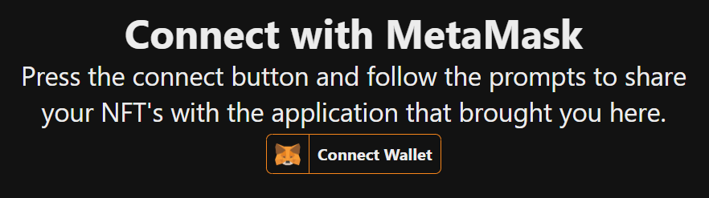

# Unity NFT Service


## Overview
This application stack provides a quick way to fetch a users NFT's and associated metadata which can be easily integrated into a game engine like Unity.

All you need to do is forward the user to your deployed instance and have them link their wallet.

---

##### Table of Contents  
- [What's Included](#what-s-included)
  * [NGINX + React App](#nginx---react-app)
  * [Express API](#express-api)
  * [MongoDB](#mongodb)
- [Getting Started - Deployment](#getting-started---deployment)
  * [.env](#env)
  * [Deploying to Azure Container Instance](#deploying-to-azure-container-instance)
- [Integration with Unity](#integration-with-unity)

Docker Hub Links
- [nickjordan289/unitynftservice-client](https://hub.docker.com/repository/docker/nickjordan289/unitynftservice-client)
- [nickjordan289/unitynftservice-server](https://hub.docker.com/repository/docker/nickjordan289/unitynftservice-server)

# What's Included
## NGINX + React App
NGINX serves the built react app and routes any requests beginning with /api/ to the express api.

This site will return data back to the unity application using the redirect_uri parameter. See Below.

See [nginx.conf](client/nginx.conf)
## Express API
The Express api handles the authentication and nft fetching processes. After validating you own the wallet you will receive a session token that you can save in your application.
1. GET /api/nfts/?sessionId=...
    - Query Parameters:
        - sessionId: string - the sessionId generated on login
    - Return the nfts for the account associated with the sessionId
2. POST /api/validateWalletLogin/
    - Body:
      - address: string - the self reported address
      - message: string - the generated message that the wallet signed
      - signature: string - the signature of the wallet signed message
      
    - Validate the signature from the wallet login and return a sessionId
    - If resolved address does not match the address in the request, fail and let user try again

## MongoDB
This application stack utilizes MongoDB for storing session tokens and caching responses.

# Getting Started - Deployment
> The Alchemy.com sdk is used to fetch an address' NFT's
1. Setup your .env configuration as described below
2. Run container group using ```docker compose up```

## .env
```py
APP_SERVER_PORT=4000
REACT_APP_PORT=3000

# https://www.alchemy.com/
ALCHEMY_API_KEY="..."

MONGO_INITDB_ROOT_USERNAME="AzureDiamond"
MONGO_INITDB_ROOT_PASSWORD="hunter2"

# used to set fqdn when deploying to azure
ACI_DOMAIN_LABEL="unitynftservice" 
```

## Deploying to Azure Container Instance
> https://learn.microsoft.com/en-us/azure/container-instances/tutorial-docker-compose
1. ```docker context create aci myacicontext```
2. ```docker context use myacicontext```
3. Set your ```ACI_DOMAIN_LABEL``` in the environment variables
4. ```docker compose up```

# Integration with Unity
After signing into the app it will redirect you to http://localhost:8001 or whatever is supplied in the redirect_uri query parameter.

This allows you to listen for a response on a given port and store the resulting sessionId for use in queries later.

See below snippet on how you may implement this using HttpListener.
[HttpListener Docs](https://learn.microsoft.com/en-us/dotnet/api/system.net.httplistener?view=net-7.0)
```cs
HttpListener listener = new HttpListener();

// Define which port you want to listen to and add it to the HttpListener
var redirectUri = "http://localhost:8001";
listener.Prefixes.Add(redirectUri);

// Open our login page in the browser and supply the redirect_uri
Application.OpenURL($"{ApiServer}?redirect_uri={redirectUri}");

// Start listening 
listener.Start();

//
// This is thread blocking until a request is found
//
var context = listener.GetContext();
var request = context.Request;

// Save the wallet address and sessionId into PlayerPrefs for use later
var address = request.QueryString.Get("address");
var sessionId = request.QueryString.Get("sessionId");
PlayerPrefs.SetString("address", address);
PlayerPrefs.SetString("sessionId", sessionId);

// Construct a response.
var response = context.Response;
var responseString = "<HTML><BODY><b>You have successfully connected your Ethereum wallet.</b><br/><br/>You can now close this window and return to the application that brought you here.</BODY></HTML>";
var buffer = System.Text.Encoding.UTF8.GetBytes(responseString);

// Get a response stream and write the response to it.
response.ContentLength64 = buffer.Length;
System.IO.Stream output = response.OutputStream;
output.Write(buffer, 0, buffer.Length);
output.Close();

// Finished
listener.Stop();

// Use sessionId to retrieve users nft's
var response = await client.GetAsync($"{ApiServer}/api/nfts?sessionId={sessionId}");
var content = await response.Content.ReadAsStringAsync();
```